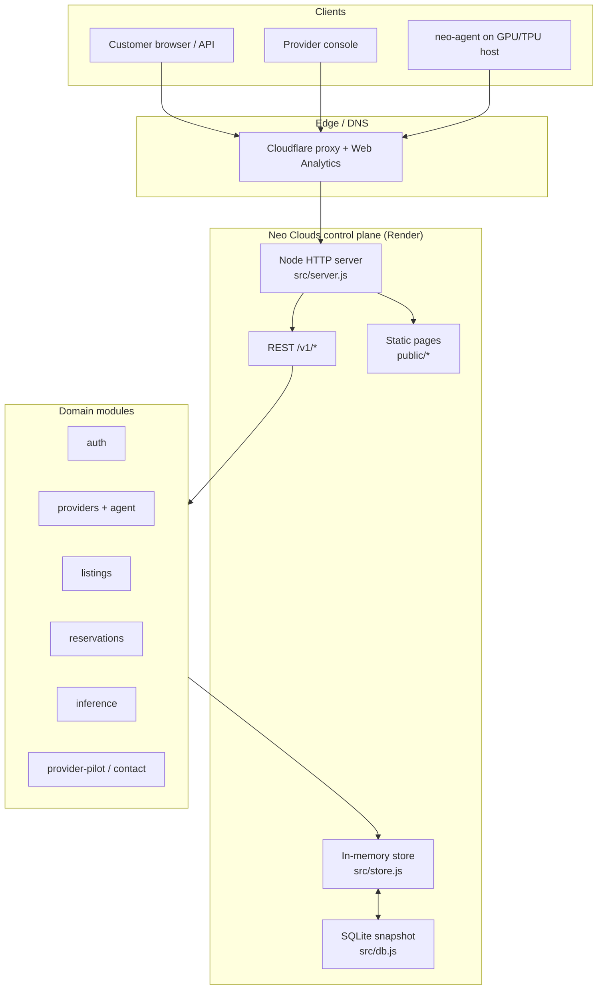
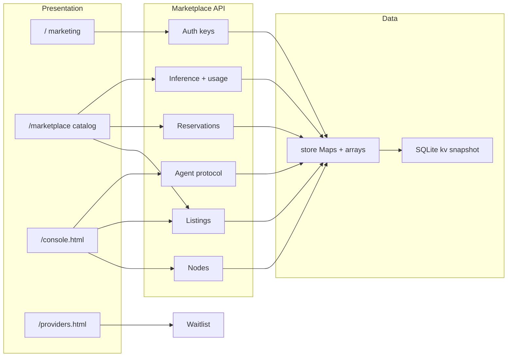
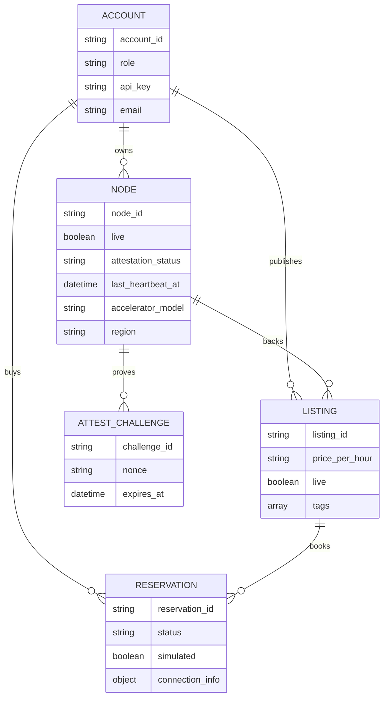
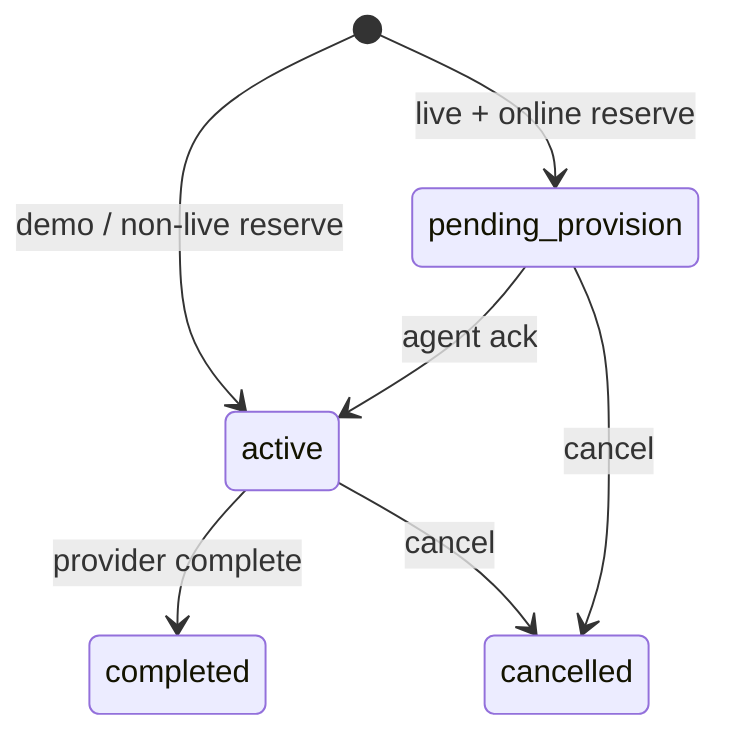
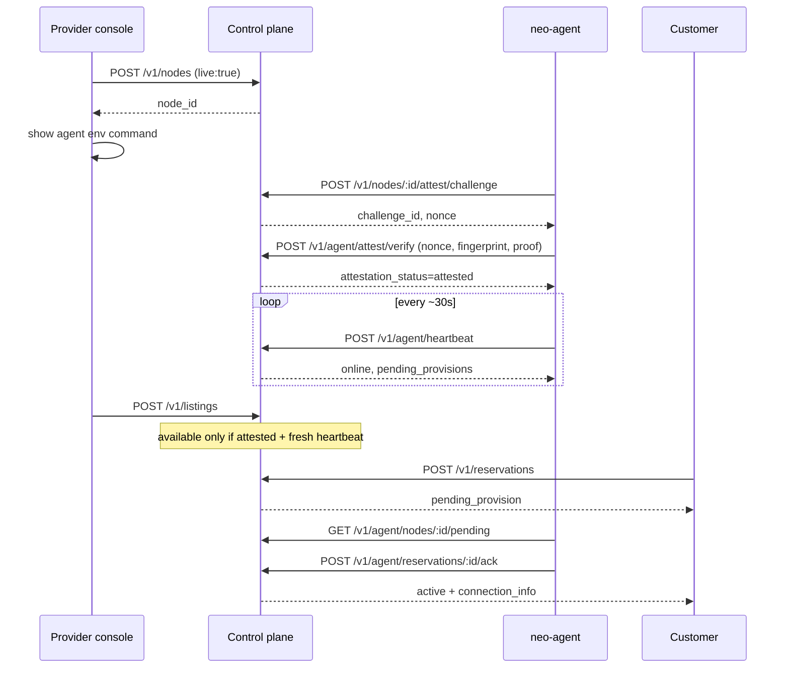
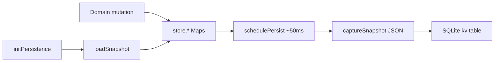
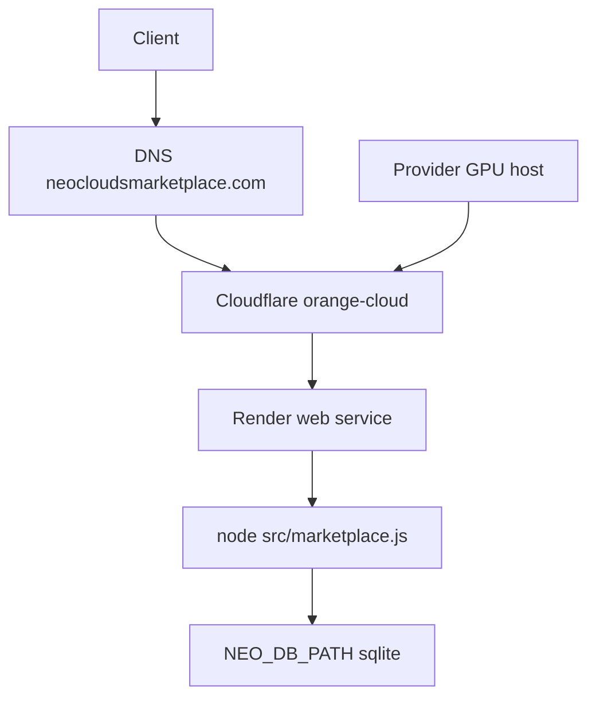
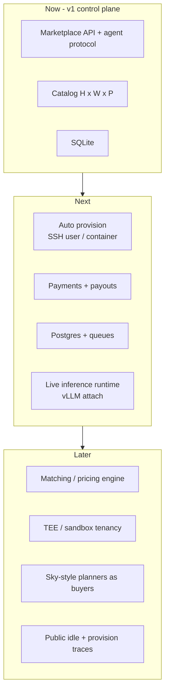

# Neo Clouds — System Design Document

**Status:** Early access / working prototype  
**Canonical site:** https://neocloudsmarketplace.com  
**Aligned paper:** `papers/neo-clouds-unused-accelerator-marketplace.md` (research preprint; open/merge that PR if not on `main` yet)  
**Hardware connect guide:** [HARDWARE.md](./HARDWARE.md)  
**HTML:** [/system-design.html](./public/system-design.html) · **PDF:** [/system-design.pdf](./public/system-design.pdf)  
**Version:** 1.0 · September 2026

This document describes the **control-plane architecture** for an open marketplace that turns *unused* GPUs and TPUs into discoverable, reservable capacity. It matches the preprint’s framing: supply aggregation and market discovery first; full cluster orchestration, payments, and confidential multi-tenancy as later layers.

---

## 1. Goals and non-goals

### Goals

| Goal | Design implication |
|---|---|
| Unused → online | Providers list idle accelerators; live nodes require agent presence |
| Low / transparent cost | Listed $/hr in catalog; payments disabled in early access |
| Open | Open APIs, open catalog axes, open-source control plane |
| Trust asymmetry reduced | Challenge attest (identity) ≠ heartbeat (liveness) |
| Builder-friendly | REST + OpenAI-compatible inference surface |

### Non-goals (current generation)

- Automatic SSH user / container provisioning on provider hosts  
- Payments, escrow, or payouts  
- Cross-cloud job scheduler (Sky-style planner is a future consumer of reservations)  
- Confidential computing / TEE-backed isolation  
- Guaranteed SLA fleets at hyperscaler scale  

---

## 2. Design principles

1. **Separate catalog truth from demo UX.** Seeded inventory may be `simulated`; live nodes are explicit (`live: true`) and gated by attest + heartbeat.
2. **Thin provider integration.** A host-side `neo-agent` is enough to go live—no requirement to run a full orchestrator on day one.
3. **Availability is derived, not stored as gospel.** Listing “available” is computed from node attestation, heartbeat TTL, and reservation conflicts.
4. **Workload-aware discovery.** Catalog axes are hardware × workload tags × price—not SKU-only.
5. **Honest early access.** UI and API advertise simulated vs live; no payment collection.

---

## 3. High-level architecture

**Runtime:** single Node.js process (`npm start` → `src/marketplace.js`)  
**Host:** Render web service `neo-clouds-marketplace`  
**Domain:** `neocloudsmarketplace.com` (often via Cloudflare → Render)

---

## 4. Logical component view

| Module | Path | Responsibility |
|---|---|---|
| Entry | `src/marketplace.js` | Boot, persistence init, seed, listen |
| HTTP | `src/server.js` | Routes, static assets, health/config |
| Store | `src/store.js` | Process-local source of truth |
| DB | `src/db.js` | Debounced SQLite snapshot persist/hydrate |
| Auth | `src/auth.js` | Register accounts, API keys, roles |
| Providers | `src/providers.js` | Node register, stub attest (demo), begin challenge |
| Agent | `src/agent.js` | Heartbeat, challenge verify, pending, ack |
| Listings | `src/listings.js` | CRUD + filters + derived availability |
| Reservations | `src/reservations.js` | Lifecycle simulated vs live |
| Inference | `src/inference.js` | Models + chat completions (+ usage) |
| Seed | `src/seed.js` | Demo providers/listings when `SEED_DEMO=1` |

---

## 5. Core domain model

### Reservation status machine

| Kind | On reserve | Connection info |
|---|---|---|
| Simulated / demo node | `status=active` immediately | Placeholder SSH note; not real provision |
| Live node (attested + heartbeat) | `status=pending_provision` | Filled on agent `ack` |

---

## 6. Live hardware connect (agent protocol)

Aligned with paper §5: **attestation ≠ liveness**.

### Availability predicate (live)

A listing is available iff:

1. Backing node exists and `attestation_status === 'attested'`
2. If node is live: `now - last_heartbeat_at ≤ HEARTBEAT_TTL_MS` (default 90s)
3. No reservation on that listing in `active` or `pending_provision`

### Agent API surface

| Method | Path | Purpose |
|---|---|---|
| `POST` | `/v1/agent/heartbeat` | Mark online / refresh inventory snapshot |
| `POST` | `/v1/nodes/:id/attest/challenge` | Issue nonce |
| `POST` | `/v1/agent/attest/verify` | Bind fingerprint proof |
| `GET` | `/v1/agent/nodes/:id/pending` | List `pending_provision` jobs |
| `POST` | `/v1/agent/reservations/:id/ack` | Supply SSH/connection details |

Host binary: `scripts/neo-agent.mjs`.

---

## 7. Catalog and discovery

Buyers query `GET /v1/listings` with filters aligned to paper §6:

| Axis | Mechanism |
|---|---|
| Hardware | `accelerator_type`, `gpu_model` / `accelerator_model`, `interconnect`, `min_vram_gb` |
| Workload | `workload` or `tags` (training / inference / fine-tune) |
| Price | `max_price_per_hour`, `sort=price_asc\|price_desc` |
| Availability | `available=true\|false` |

UI (`public/marketplace.html`) mirrors these axes and badges **LIVE** vs **SIMULATED**.

---

## 8. API map (control plane)

### Public / lightly gated

| Area | Endpoints |
|---|---|
| Health | `GET /api/health`, `GET /api/config` |
| Auth | `POST /v1/auth/register`, `GET /v1/auth/me` |
| Catalog | `GET /v1/listings`, `GET /v1/listings/:id` |
| Models | `GET /v1/models` |
| Stats | `GET /v1/stats`, `GET /v1/leaderboard` |
| Inbound | `POST /v1/contact`, `POST /v1/provider-pilot` |

### Provider-authenticated

Nodes, listings CRUD, stub attest (non-live), challenge begin, agent routes, reservation complete.

### Customer-authenticated

`POST /v1/reservations`, list/get/cancel own reservations, chat completions + usage.

---

## 9. Data and persistence

- **Source of truth at runtime:** in-process `store`  
- **Durability:** SQLite file via `NEO_DB_PATH` (default `data/neo-clouds.sqlite`)  
- **Tests:** `:memory:` or persistence off  
- **Deploy caveat:** Render free disk is ephemeral—attach a persistent disk for `data/` in production  

No separate Postgres/queue yet; acceptable for early access single-node control plane.

---

## 10. Trust model and threat sketches

| Risk | Current mitigation | Future hardening |
|---|---|---|
| Stale “available” listings | Heartbeat TTL | Provider SLA metrics / reputation |
| Fake hardware checkbox | Challenge + fingerprint proof; stub attest blocked when `live` | Device attestation (NVIDIA / TPU topology) |
| Malicious customer code on seller host | Out of band (provider configures SSH) | Mediated containers / VMs / TEEs |
| Key leakage | Bearer API keys | Scoped keys, rotation, OAuth |
| Inventory spoofing across providers | `provider_id` ownership checks | Stronger identity + payout KYC when payments land |

**Payments:** explicitly disabled. Listed prices are discovery signals only.

---

## 11. Deployment architecture

| Concern | Choice |
|---|---|
| App platform | Render Blueprint (`render.yaml`) |
| Process model | Single web service |
| Config | `SEED_DEMO`, `CANONICAL_DOMAIN`, `NEO_DB_PATH`, `AGENT_HEARTBEAT_TTL_MS` |
| Analytics | Cloudflare Web Analytics beacon in `public/*.html` |
| Health | `GET /api/health` |

---

## 12. Target architecture (roadmap)

Aligned with paper §8 research agenda—**not all built yet**:

---

## 13. Key sequences (buyer / seller)

### Seller (live)

1. Register provider key → `/console.html`  
2. Register `live` node  
3. Run `neo-agent` (attest + heartbeat + ack loop)  
4. Publish listing with workload tags + price  
5. When customer reserves, agent acks connection info  

### Buyer

1. Browse `/marketplace` (or `GET /v1/listings`)  
2. Get customer API key  
3. Reserve hours  
4. If **LIVE**: wait for `active` + use `connection_info`  
5. If **SIMULATED**: immediate demo reservation; no real GPU  

---

## 14. Quality and operability

| Concern | Approach |
|---|---|
| Correctness | `npm test` (`test/*.test.js`, concurrency 1) |
| Honesty signals | Beta banner, `simulated` flags, `/api/config` |
| Observability | `/api/health` counters (`liveNodes`, `onlineLiveNodes`) |
| Docs | `HARDWARE.md`, `LAUNCH.md`, this design doc, preprint |

---

## 15. Document map

| Doc | Role |
|---|---|
| This file | Engineering system design + architecture |
| `papers/neo-clouds-unused-accelerator-marketplace.md` | Research framing / agenda |
| `papers/WHERE_TO_PUBLISH.md` | Publication strategy |
| `HARDWARE.md` | Provider onboarding runbook |
| `LAUNCH.md` | Deploy / DNS checklist |
| `PRODUCT.md` | Product boundary vs Student AI Hub |

---

## 16. Summary

Neo Clouds’ architecture is a **marketplace control plane**: auth, node identity, listing discovery, reservation lifecycle, and an agent protocol that binds live supply to attested, heartbeating hosts. It intentionally stops short of full orchestration and payments so the system can ship an open, honest unused-accelerator exchange—and grow toward matching, secure multi-tenancy, and measured utilization as described in the companion paper.
